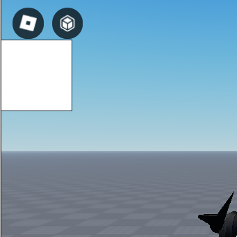
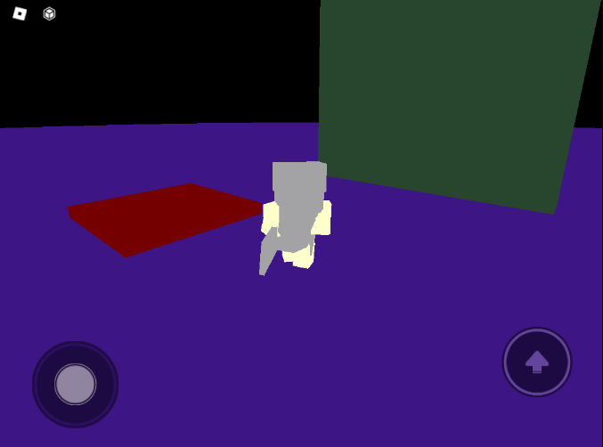

# my silly journey on making a raytracer on roblox

honestly, why not? 

it's incredibly easy to make a simple raytracer in roblox since pretty much all the heavy work is already done in the shadows

and the recent addition of DynamicImages (drawable textures) opens the door for higher resoluation renders and less overhead 

(before, people would need to create thousnads of frames to emulate a pixel. not efficient by any means!!)

# fflags and DynamicImages are cool

roblox hasn't released DynamicImages globally yet.. so we need to enable them via fflags

this can be done by setting the "FFlagDynamicImageEnabled" FFlag to true

**future me, this isn't true anymore, roblox changed "DynamicImage" to "EditableImage"**
**instead, the FFlag to toggle is "FFlagEditableImageEnabled"**

DyanmicImages... err *EditableImages* can be created like this:

```lua

function ImageNew(Width : number, Height : number, Parent : Instance )
	
	local ScreenGui = Instance.new("ScreenGui")
	local ImageLabel = Instance.new("ImageLabel")
	local DynImage  : EditableImage  = Instance.new("EditableImage")
	
	DynImage.Parent = ImageLabel
	DynImage.Size = Vector2.new(Width,Height)

	ImageLabel.Size = UDim2.new(0,Width,0,Height)
	ImageLabel.Parent = ScreenGui

	ScreenGui.Parent = Parent

    return DynImage
end


```

and to draw an image..

```lua
....

local Image = ImageNew(100,100,script.Parnet) -- script.Parent, assuming the script is parented under ScreenGui

local Img = table.create((100*100)*4,1) -- create a white RGBA buffer 
-- example: {r,g,b,a , r,g,b,a}
--          [pixel 1]  [pixel2]

Image:WritePixels(Vector2.new(0,0),Image.Size,Img)


```



*so blank, so white*


i made a module simplifying the use of EditableImages


# i like rays

~~roblox's raycaster isn't fast enough for real time rendering, even at 240p!~~

doing basic raycasting in roblox is easy as watching a cat video on youtube

```lua
local Canvas = require(script.Canvas)
local NewCanvas = Canvas:New(Width,Height,script.Parent)
local CurrentCamera = workspace.CurrentCamera
local Width , Height = CurrentCamera.ViewportSize.X,CurrentCamera.ViewportSize.Y

Width //=1
Height //=1


local ray
local raycast

task.wait(5)

for y=1,Height do
	
	for x=1,Width do
		
		ray = CurrentCamera:ScreenPointToRay(x,y)
		raycast = workspace:Raycast(ray.Origin,ray.Direction*200)
		
		if not raycast then
			-- sky?
			NewCanvas:SetPixel(x,y,0,0,0)
			continue
		end
		
		local color = raycast.Instance.Color
		
		local r = color.r
		local g = color.g
		local b = color.b
	
		NewCanvas:SetPixel(x,y,r,g,b)
		
	end
	
end

NewCanvas:Draw()
```

the output is a black sky, and flat colors 



i think we can improve upon this, lets add:

- shading
- reflections
- uv mapping

## shading

