# THEY. JUST. WONT. STOP.

### and no matter what i try to do, they keep on messaging me on different numbers

today (*Wednesday, January 2, 2024*), i got 5 phishing messages today.. and it's all about the same thing, canada post missed delivery, intrac bank deposit, etc.

in fact, it’s SUCH a common issue nowadays that there's like reddit posts about this:

+ **[reddit post 1](https://www.reddit.com/r/CanadaPost/comments/17az2h2/new_text_scam/)**
+ **[reddit post 2](https://www.reddit.com/r/Markham/comments/18x7iwy/anyone_else_get_this_scam_text/)**
+ **[reddit post 3](https://www.reddit.com/r/CanadaPost/comments/18x29ke/incomplete_address_information_help/)**
+ **[reddit post 4](https://www.reddit.com/r/FidoMobile/comments/18vapx4/new_scam/)**

and those phishing websites are so convincing, right down to a tee they managed to scrape the css, html for popular banking websites. even the url looks sort of convincing!!

anyways, venture with me to discover how these websites work and the eventual destruction i’ll impose on them

# the websites

most, if not all the phishing websites i receive in my messages are the same. same api endpoints, same css and html layouts. probably the people running the sms phishing campaign are using a phishing-as-a-service platform to send the phishing messages right to my device. 

# “secure-fidosolutions.com”

this website checks if i’m using a phone or desktop. if it’s a phone, then i’m allowed in. 

if it’s a desktop, then i’m redirected to google. this is very simple to bypass, since i can just change the user agent using the chrome developer settings:

**(also, some of these sites DO check the monitor resolution to also determine if it’s being visited by a desktop, again, bypassable by resizing the browser window.)**

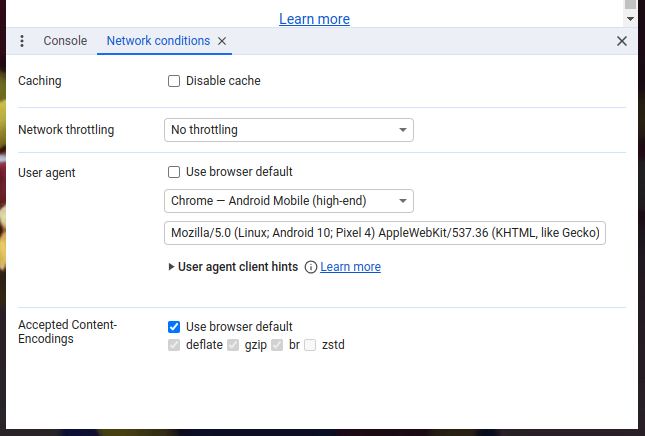

once i set the user agent, i am allowed in.. and they ALWAYS use the same bloody captcha system i swear to god..

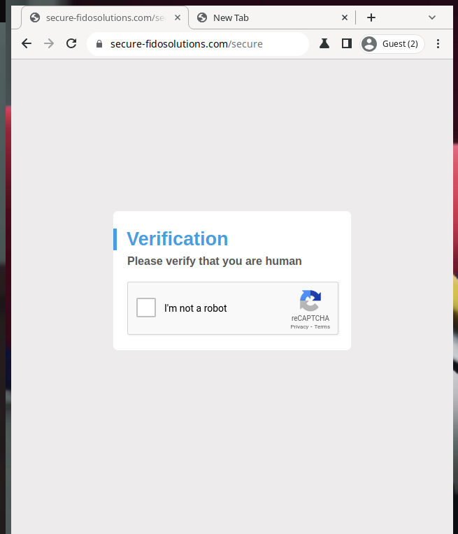

you see, this is what i mean about these websites being very convincing

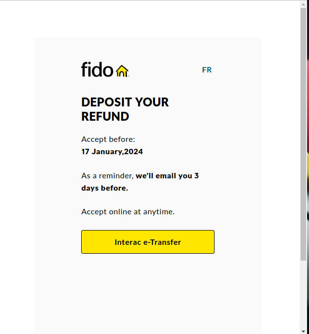
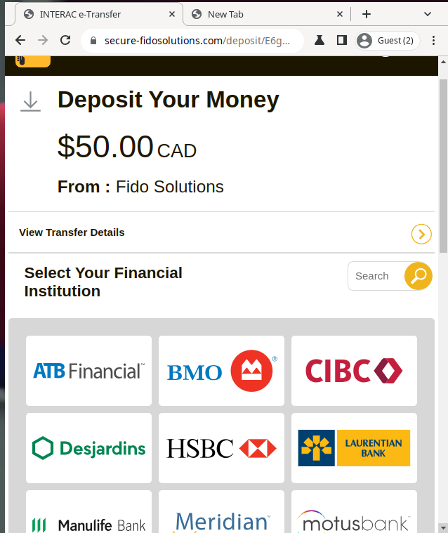

###
---
### [meta] **[at exactly 2:06 am, the website shutdown as while writing this blog post.. and it’s back up again at 2:08 am.. is someone ddosing the website for me lol???]**
---
###

the network traffic is rather interesting, take a look:

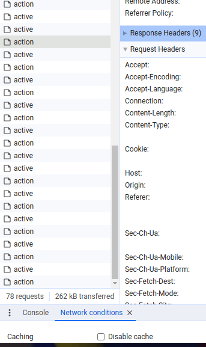

Action.. Active.. Action.. Active.. 

these requests are both done on intervals of about 1 second. they are basically phoning home to the scammers on what i’m currently doing on the website

i noticed some website elements do not function, like the language switcher.. giveway that this is fake

don’t be fooled, we’re not at the ACTUAL CIBC login page, in fact! we're still on the scam website, just that we're on a subpage

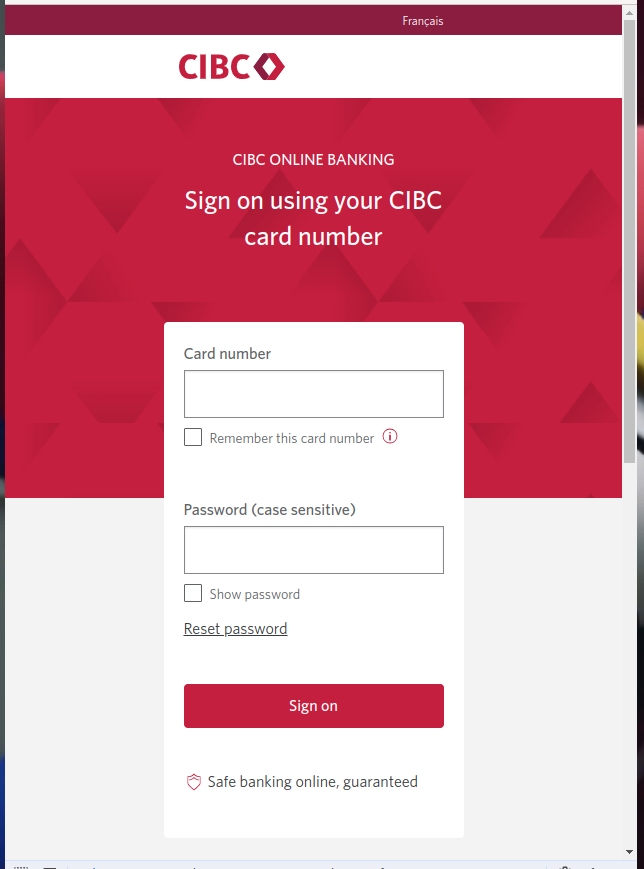

and let me tell you, this is the most ADVANCED phishing page, i’ve ever looked at. they DO check if the card is vaild in REAL time and they also send your information to the scammers in REAL time. 

 post requests of current login data:

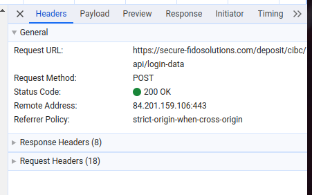

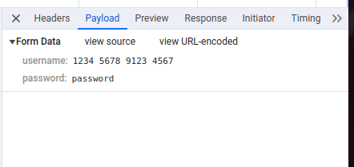

see, i can’t “sign on” because card is obviously bogus, the card got sent to the scammer's server anyway..

the verification system is using something called the "Luhn Algorithm”

how did i know, well i did a peek into the websites javascript.. which is surprisingly not obfuscated!

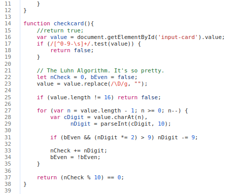

(the code is literally copied from a stackoverflow answer lmao)
https://stackoverflow.com/questions/12310837/implementation-of-luhn-algorithm

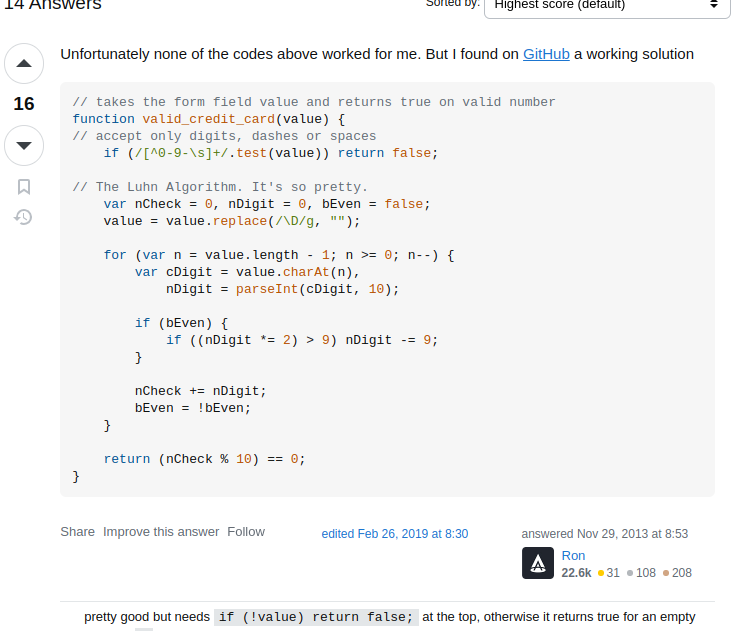

# blowing up the servers

since these websites do NOT have any sort of ddos protection, it’s actually easy to take them down with conventional hardware.

LITERALLY what i’m doing is just sending repeated requests to the server using curl across multiple processes. 

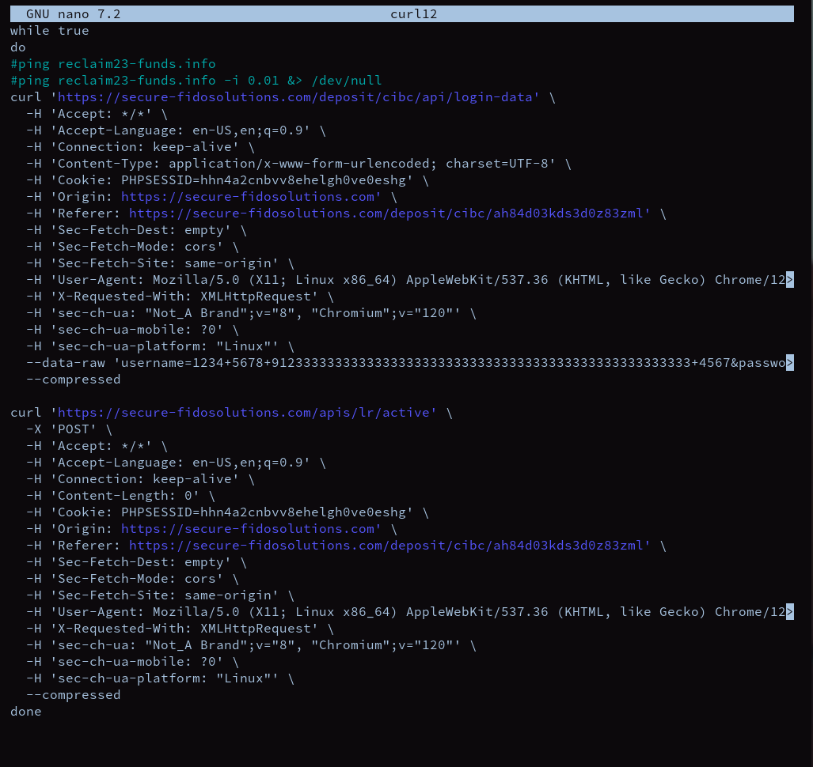

the server begins to die

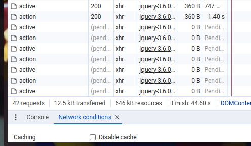

painfully

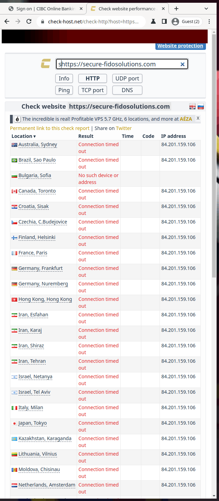

hopefully, they enjoy the bougs login information flooding their telegram 

maybe they'll stop messaging me? who knows